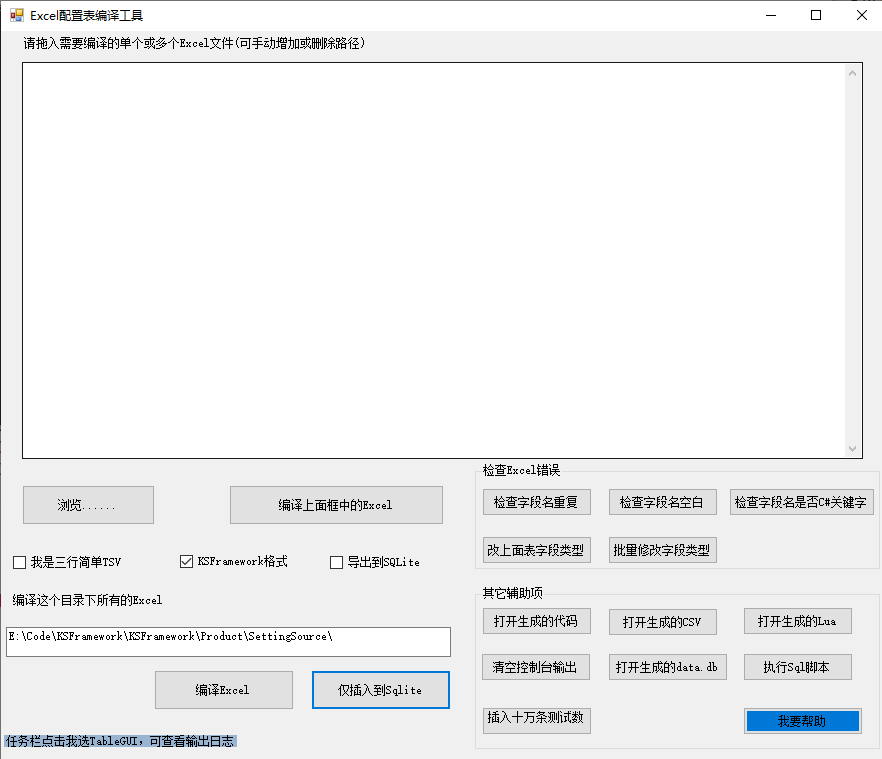

# TableML

TableML, Table Markup Language, 基于电子表格的标记语言，

类似JSON, XML, INI，TableML可以作为软件项目的配置标记语言，

与之不同的是，您可以使用Excel等电子表格编辑软件来配置TableML，自由地添加图标、注释、VB脚本和预编译指令，再由TableML编译器导出干净的TSV格式的配置表表格，编辑方便，使用简单。

目前提供C#版本的运行时、编译器、代码生成器。

快速开始： [quick_start.md](./quick_start.md) 

更新日志：  [update_log.md](./update_log.md) 



## Example


您可以使用Excel编译如下内容，并保存为文件setting/test.xls(同时支持csv文件):

| Id          | #Something | Value    | Comment        |
| ----------- | ---------- | -------- | -------------- |
| int         | string     | string   | string         |
| 关键字/注释行     | 带#开头的注释列   | 内容       | 带Comment开头的注释列 |
| 1           | 无用注释       | Abcdefg  | 一些注释           |
| #注释行        | 无用注释       | Abcdefg  | 一些注释           |
| Comment注释行  | 无用注释       | Abcdefg  | 一些注释           |
| 2           | 无用注释       | Yuiop    | 一些注释           |
| #if LANG_TW |            |          |                |
| 123         | 这一行不会被编译   | skldfjlj | 一些注释           |
| #endif      |            |          |                |


然后使用TableML命令行编译器：
```bash
TableML.exe --Src setting --To setting2 --CodeFile Code.cs
```

执行后，将会生成setting2/test.tml文件，打开可以看见编译后内容：

| Id   | Value   |
| ---- | ------- |
| int  | string  |
| 1    | Abcdefg |
| 2    | Yuiop   |

另外附带一份Code.cs，自动生成的代码。

## TableML编辑规则

以上的例子中，展示了TableML的大部分特性：

- TableML使用Excel等电子表格软件作为编辑器，并通过编译器导出成tml格式文件
- tml格式文件实质是TSV格式，即Tab Sperated Values，类似CSV
- 行头占3行：
    - 第1行是列名
    - 第2行是列的信息，通常是声明列的类型,可以自定义
    - 第3行是列的注释
    - 除外的所有行为内容
- 列名内容以#开头或Comment开头，改列被视为注释列，编译器忽略
- 行内容的第一个单元格内容，以#开头或Comment开头，改行被视为注释行，编译器忽略
- 可以使用预编译指令#if和#endif，条件式控制编译的行

## 开发者指南

### 命令行方式

1. 通过git clone 或者download master的方式将工程下载到本地
2. 建议使用visual studio2012及更高版本打开 **TableML\TableML.sln**
3. 在vs中设置**TableMLCompilerConsole** 为启动项目(解决方案面板，选中项目，**右键** - **设为启动项目**)
4. 建议把项目的输出设为**Release**，然后选择 **菜单栏** - **生成** - **生成TableMLCompilerConsole** 
5. 打开目录 **TableML\TableMLCompilerConsole\bin\Release** 可以看到已经生成了**TableML.exe**

### GUI方式

1. 通过git clone 或者download master的方式将工程下载到本地
2. 建议使用visual studio2012及更高版本打开 **TableML\TableML.sln**
3. 在vs中设置**TableMLGUI** 为启动项目(解决方案面板，选中项目，**右键** - **设为启动项目**)
4. 开发过程中设置为Debug，生产环境项目设为**Release**，然后按下快捷键F5
5. 在弹出的GUI窗口中进行编译Excel

**TableML**

- tml(tsv)文件读取接口

**TableMLCompiler**

- 对excel/csv 源文件进行编译

**TableMLCompilerConsole**

- 命令行窗口，根据条件对excel进行编译

**TableMLGUI**

- 提供GUI界面，增加编译选定excel，将数据导入到sqlite中
- 增加excel的查错，输出操作日志

**TableMLTests**

- 编译功能的单元测试

### 自定义配置

**1. 从第2列(指定列)开始读**

​	修改SimpleExcelFile.cs中的StartColumnIdx值如：

```c#
   public const int StartColumnIdx = 1;
```


**2.每个表对应一个Class文件**

调用方法如下：

```c#
batchCompiler.CompileTableMLAllInSingleFile(srcDirectory, OutputDirectory, CodeFilePath,           templateString, "AppSettings", ".tml", null, true);
```

示例代码可参考：LocalDebug.cs中的CompileAll()


**3.修改生成的代码模版**

修改TableML.Compiler.DefaultTemplate中的字符串模版


**4.预留指定行，自定义行，比如第6行是字段名，第8行是数据类型，第15行是字段注释**

扩展`SimpleExcelFile.PreserverRowCount = 预留行`

根据实际表格格式修改SimpleExcelFile.headRowIdx，typeRowIdx等字段数量


### For KSFramwork

对于[KSFramework](https://github.com/mr-kelly/KSFramework) 会使用到这两个工程中的dll

- TableML
- TableMLCompiler


## 读取规则

先读取Excel的行，再读取列，把数据写入到tml文件中。

## 内存溢出

如果在使用TableMLGUI时，特别占用内存，建议把excel另存为csv格式，或者减少单个excel文件的大小，以减少内存占用。

## For SQLite

TableMLGUI提供一键将excel数据插入到sqlite中。

采用sql的事务机制，在插入大量数据环境下，耗时更短。

同时在控制台输出sql语句方便调试查错。


## 自动读取配置代码生成

TableML编译器内置Liquid模板引擎。您可以自定义模板内容，来为不同的语言生成读表类。

TableML是[KSFramework](https://github.com/mr-kelly/KSFramework)的一部分，用于游戏配置表读取代码，支持热重载、分表等机制。

## TableML for C#/Mono/Xamarin

TableML目前只提供C#版本。当前TableML使用基于Xamarin Studio开发，TableML的C#版本具备了跨平台特性（Windows/Mac/Linux）。
